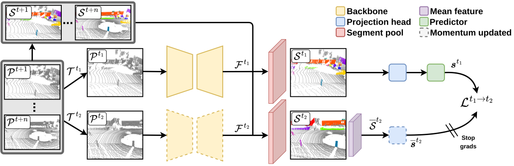

# TARL: Temporal Consistent 3D LiDAR Representation Learning for Semantic Perception in Autonomous Driving

**[Paper](http://www.ipb.uni-bonn.de/pdfs/nunes2023cvpr.pdf)** **|** **[Sup. material](http://www.ipb.uni-bonn.de/pdfs/nunes2023cvpr-supmaterial.pdf)** **|** **[Video](https://www.youtube.com/watch?v=0CtDbwRYLeo)**

This repo contains the code for the self-supervised pre-training method proposed in the CVPR'23 paper: Temporal Consistent 3D LiDAR Representation Learning for Semantic Perception in Autonomous Driving.

Our approach extract temporal views as augmented versions of the same object. We aggregate sequential LiDAR scans, and by removing the ground (in an unsupervised manner) and clustering the remaining points we define coarse segments of objects in the scene to be used for self-supervised pre-training. We evaluate our pre-training by fine-tuning the pre-trained model to different downstream tasks. In our experiments we show that our approach could significantly reduce the amount of labels needed to achieve the same performance as the network trained from scratch using the full training set.



## Dependencies

To run our code first install the dependencies with:

```
sudo apt install build-essential python3-dev libopenblas-dev
pip3 install -r requirements.txt
```

Followed by installing MinkowskiEngine from the official repo:

```
pip3 install -U git+https://github.com/NVIDIA/MinkowskiEngine --install-option="--blas=openblas" -v --no-deps
```

Then you need to run the code setup with:

`pip3 install -U -e .`

## SemanticKITTI Dataset

The SemanticKITTI dataset has to be download from the official [site](http://www.semantic-kitti.org/dataset.html#download) and extracted in the following structure:

```
./
└── Datasets/
    └── SemanticKITTI
        └── dataset
          └── sequences
            ├── 00/
            │   ├── velodyne/
            |   |       ├── 000000.bin
            |   |       ├── 000001.bin
            |   |       └── ...
            │   └── labels/
            |       ├── 000000.label
            |       ├── 000001.label
            |       └── ...
            ├── 08/ # for validation
            ├── 11/ # 11-21 for testing
            └── 21/
                └── ...
```

For the unsupervised ground segmentation, you need to run [patchwork](https://github.com/LimHyungTae/patchwork) over the SemanticKITTI dataset and put the generated files over:
```
./
└── Datasets/
    └── SemanticKITTI
        └── assets
            └── patchwork
                ├── 08
                    ├── 000000.label
                    ├── 000001.label
                    └── ...
```

For SemanticKITTI we have available [here](https://www.ipb.uni-bonn.de/html/projects/tarl/ground_labels.zip) the ground segment labels to be used in
our pre-training.

**Note** that using patchwork is **not** the only option to have ground prediction. Among other options one could for example use ransac implementation
from Open3D which would give also a ground estimation (as done by SegContrast). We have also implemented this option you could use ransac by setting
in the config file the flag `use_ground_pred: False`. However, we recommend using patchwork since the ground segmentation is more accurate.

## Custom dataset

To use our pre-training with a different dataset we provide some few instructions on how to do it at [NEW_DATA.md](https://github.com/PRBonn/TARL/blob/main/tarl/datasets/NEW_DATA.md).

## Running the code

The command to run the pre-training is:

```
python3 tarl_train.py
```

In the `config/config.yaml` the parameters used in our experiments are already set.

Note that, the first epoch will take longer to train since we generate the segments over the aggregated scans and save them to disk. However, after
the first epoch the training should be first since it is just necessary to load the segments from disk.

## Docker

We have also a `Dockerfile` in `docker/` directory to make things easy to run. You can build the docker image locally in case any changes
regarding CUDA is needed with:

```docker build . -t nuneslu/tarl:latest```

In case it is not needed, you can run it directly with docker-compose and the image will be downloaded from docker hub:

```CUDA_VISIBLE_DEVICES=0 docker-compose run pretrain python3 tarl_train.py```

## Pre-trained weights

- TARL MinkUNet pre-trained [weights](https://www.ipb.uni-bonn.de/html/projects/tarl/lastepoch199_model_tarl.pt)

---

# Fine-tuning

For fine-tuning we have used repositories from the baselines, so after pre-training with TARL you should copy the pre-trained weights to the target task and use it for fine-tuning.

## Semantic segmentation

|Method         | Scribbles | 0.1% | 1% | 10% | 50% | 100% |
|----------------|-----------|--------|--------|--------|--------|--------|
|No pre-training         | 54.96% | 29.35% | 42.77% | 53.96% | 58.27% | 59.03% |
|PointContrast   | 54.52% | 32.63% | 44.62% | 58.68% | 59.98% | 61.45% |
|DepthContrast   | 55.90% | 31.66% | 48.05% | 57.11% | 60.99% | 61.14% |
|SegContrast     | 56.70% | 32.75% | 44.83% | 56.31% | 60.45% | 61.02% |
|**TARL (Ours)** |**57.25%**|**38.59%**|**51.42%**|**60.34%**|**61.42%**|**61.47%**|


For fine-tuning to semantic segmentation we refer to the SegContrast [repo](https://github.com/PRBonn/segcontrast).
Clone the repo with `git clone https://github.com/PRBonn/segcontrast.git` and follow the installation instructions. Note that the requirements from
TARL and segcontrast are similar since both use `MinkowskiEngine` so you should be able to use the same environment than TARL just installing
the remaining packages missing. **NOTE:** we **replaced** SegContrast optimizer from *`SGD`* to **`AdamW`** and **removed** the learning rate scheduler.

After setting up the packages, copy the pre-trained model from `TARL/tarl/experiments/TARL/default/version_0/checkpoints/last.ckpt` to `segcontrast/checkpoint/contrastive/lastepoch199_model_tarl.pt` and run the following command:

```
python3 downstream_train.py --use-cuda --use-intensity --checkpoint \
        tarl --contrastive --load-checkpoint --batch-size 2 \
        --sparse-model MinkUNet --epochs 15
```

# Object detection

For object detection we have used the OpenPCDet [repo](https://github.com/zaiweizhang/OpenPCDet) with few modifications. In this docker [image](https://hub.docker.com/r/nuneslu/segcontrast_openpcdet) we have setted up everything to run it with `MinkUNet` and to load our pre-trained weights.
The weights should be copied to `/tmp/OpenPCDet/pretrained/lastepoch199_model_tarl.pt` inside the container and then running the command:

```
cd /tmp/OpenPCDet/tools
python3 train.py --cfg_file cfgs/kitti_models/tarl_pretrained.yaml --pretrained_model ../pretrained/lastepoch199_model_tarl.pt
```
# Citation

If you use this repo, please cite as :

```
@inproceedings{nunes2023cvpr,
    author = {Lucas Nunes and Louis Wiesmann and Rodrigo Marcuzzi and Xieyuanli Chen and Jens Behley and Cyrill Stachniss},
    title = {{Temporal Consistent 3D LiDAR Representation Learning for Semantic Perception in Autonomous Driving}},
    booktitle = {{Proc. of the IEEE/CVF Conf. on Computer Vision and Pattern Recognition (CVPR)}},
    year = {2023}
}
